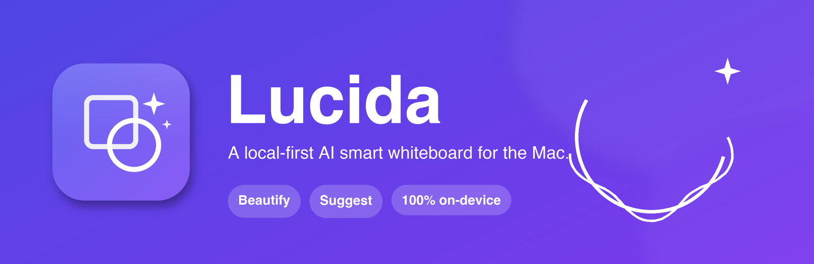
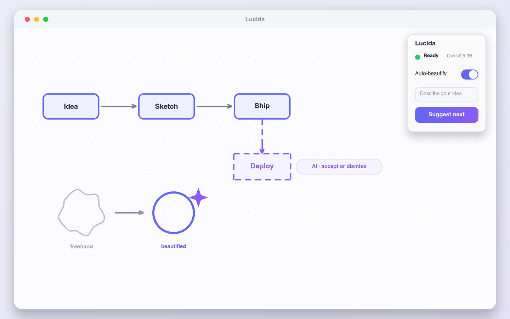
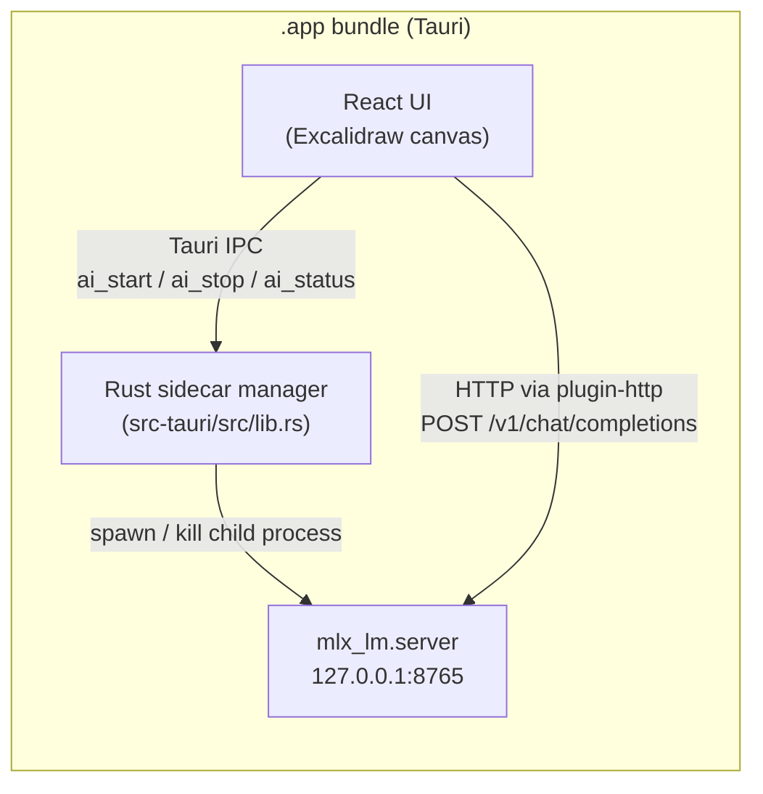

<p align="center">
  
</p>

<p align="center">
  <a href="https://github.com/Lang-Julian/lucida/actions/workflows/ci.yml"></a>
  <a href="./LICENSE"></a>
  <a href="https://tauri.app"></a>
  <a href="https://react.dev"></a>
  <a href="https://github.com/ml-explore/mlx"></a>
</p>

Sketch rough ideas and let Lucida clean them up and carry them forward. Fully
**local-first**: the AI runs on-device via [MLX](https://github.com/ml-explore/mlx),
nothing leaves your machine.

> Named after the *camera lucida*, the optical drawing aid artists used to trace
> what they saw. Rename freely.

## Demo

<p align="center">
  
</p>

<p align="center"><sub>The workspace: freehand strokes snap to clean shapes, and the local model proposes the next steps as dashed “ghost” elements you accept (<code>⌘↵</code>) or dismiss (<code>Esc</code>). <em>Illustration — a screen recording is on the way.</em></sub></p>

## Why local-first

Lucida runs **entirely on your machine**. The model server binds to `127.0.0.1`
only, there is **no telemetry**, no accounts, and no network calls to anyone
else's infrastructure — your diagrams never leave the device. Beautify is pure
geometry and needs no model at all; Suggest uses a local MLX model so even the
AI features work fully offline. Privacy is the default, not a setting.

## What it does

- **Beautify** — draw a wobbly rectangle, ellipse, diamond, triangle or line
  freehand; on pen-up it snaps to a clean shape (with `⌘Z` to undo if it
  guessed wrong). Pure geometry, no model needed — works offline instantly.
- **Suggest next** — a local LLM looks at the diagram you've drawn and proposes
  the next 1–3 elements (boxes, arrows, labels) to express the idea. They appear
  as dashed **ghost** elements you **Accept** (`⌘↵`) or **Dismiss** (`Esc`).

## How it works

Two features, two very different mechanisms:

- **Beautify is pure geometry.** A freehand stroke is analysed by the recognizer
  (`src/lib/recognizer.ts`): corner count, aspect ratio, closure and straightness
  decide whether it becomes a rectangle, ellipse, diamond, triangle or line. No
  model, no network — it runs the instant you lift the pen.
- **Suggest is a local LLM.** The current scene is summarized and sent to a local
  MLX model over an OpenAI-compatible HTTP endpoint. The model returns **JSON**
  describing the next elements; `src/lib/ai.ts` parses it into Excalidraw
  skeletons, which the canvas renders as dashed ghost elements you accept or
  dismiss.

### Architecture



The Rust layer spawns/kills the model server as a managed child process; the
React frontend then talks to that same server directly over
`http://127.0.0.1:8765` using `@tauri-apps/plugin-http` (CORS-free calls to
`127.0.0.1`).

## Stack

| Layer | Choice |
|---|---|
| Shell | **Tauri v2** (Rust) → a real, lightweight `.app` |
| UI | **React 19 + Vite 7 + TypeScript** |
| Canvas | **Excalidraw 0.18** (MIT, hand-drawn aesthetic) |
| AI | **MLX** running `mlx-community/Qwen2.5-3B-Instruct-4bit` locally, via `mlx_lm.server` (OpenAI-compatible) |
| Transport | `@tauri-apps/plugin-http` (CORS-free calls to `127.0.0.1`) |

The Rust layer spawns/kills the model server as a managed child process; the
frontend talks to it over `http://127.0.0.1:8765`.

## Prerequisites

- macOS on Apple Silicon (MLX requirement)
- Node 20+, Rust (via `rustup`), Xcode Command Line Tools
- [`uv`](https://github.com/astral-sh/uv) for the Python sidecar

## Setup

```bash
# 1. Frontend deps
npm install

# 2. Python sidecar (MLX) — creates sidecar/.venv and installs mlx-lm
uv venv --python 3.12 sidecar/.venv
uv pip install --python sidecar/.venv/bin/python mlx-lm

# 3. (Optional) pre-fetch the model so first launch is instant
sidecar/.venv/bin/python -m mlx_lm.generate \
  --model mlx-community/Qwen2.5-3B-Instruct-4bit --prompt hi --max-tokens 1
```

## Run

```bash
npm run tauri dev      # dev: hot-reload + auto-spawns the model server
npm run tauri build    # ship a .app bundle
```

Beautify works the moment the window opens. "Suggest next" lights up once the
model has loaded (the panel shows a grey → amber → green status dot).

## Configuration

Override at launch with environment variables:

| Var | Default | Meaning |
|---|---|---|
| `LUCIDA_AI_MODEL` | `mlx-community/Qwen2.5-3B-Instruct-4bit` | any MLX model id (e.g. `…Qwen2.5-7B-Instruct-4bit` for higher quality) |
| `LUCIDA_AI_PORT` | `8765` | model server port |
| `LUCIDA_AI_DIR` | `~/Developer/lucida/sidecar` | dir holding `serve.sh` + `.venv` |

> If you change the port, update the scope in
> `src-tauri/capabilities/default.json` and `DEFAULT_AI_PORT` in `src/lib/config.ts`.

## Project layout

```
src/
  lib/
    types.ts        # shared contracts (the single source of truth)
    config.ts       # port / model / ghost-opacity defaults
    recognizer.ts   # freehand stroke → clean primitive (pure geometry)
    ai.ts           # scene → local LLM → suggestions → Excalidraw skeletons
  components/
    Whiteboard.tsx  # Excalidraw wrapper: beautify + ghost-suggestion lifecycle
    AiPanel.tsx     # floating status/controls panel
  App.tsx           # shell, status polling, keyboard shortcuts
src-tauri/
  src/lib.rs        # spawns/kills the MLX sidecar; ai_start/ai_stop/ai_status
sidecar/
  serve.sh          # launches mlx_lm.server with the configured model + port
scratch/            # standalone sanity tests (not part of the build)
```

## Tests

```bash
npx tsx scratch/test-recognizer.ts   # synthetic strokes → expected shapes
npx tsx scratch/test-ai.ts           # model-output parsing + skeleton building
```

## Keyboard

| Key | Action |
|---|---|
| `⌘↵` | Suggest next (or Accept pending suggestions) |
| `Esc` | Dismiss pending suggestions |
| `⌘B` | Toggle auto-beautify |
| `⌘Z` | Undo (beautify and accept are undoable) |

## Roadmap

- **Prompt-to-canvas** — type a sentence and have the model draft a whole diagram.
- **Handwriting tidy** — recognize and straighten handwritten text, not just shapes.
- **In-app model picker** — switch MLX models from the UI without restarting.

## Contributing

See [CONTRIBUTING.md](./CONTRIBUTING.md). Security reports go through
[SECURITY.md](./SECURITY.md).

## License

[MIT](./LICENSE) © 2026 Julian Lang
